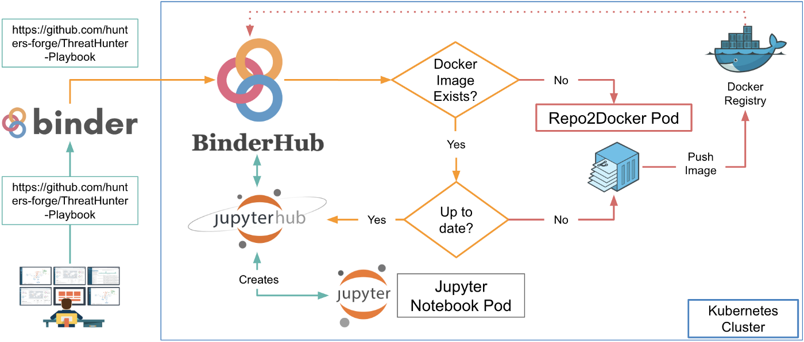

# Infosec Jupyterthon!

An open community event for security researchers to share their experience and favorite notebooks with the infosec community. We meet virtually, share notebooks, and have fun learning more about Jupyter notebooks applied to the infosec field. A great place to meet other Infosec Jovyans!

## Website https://infosecjupyterthon.com

## Event Goals

* Learn the basics of Jupyter Notebooks!
* Share knowledge around Jupyter notebooks used for real-world scenarios in the Infosec field!
* Share information about how to integrate Jupyter notebooks with other open source projects in the Infosec community!
* Have fun!

## Agenda
* [https://infosecjupyterthon.com/2021/agenda.html](https://infosecjupyterthon.com/2021/agenda.html)

## Quick Information
* **When?** December 2nd and 3rd, 2021 (8:30 AM - 5:30 PM (PST))
* **Where?** YouTube Live Stream
    * Day 1: [https://aka.ms/Jupyterthon2021Live1](https://aka.ms/Jupyterthon2021Live1)
    * Day 2: [https://aka.ms/Jupyterthon2021Live2](https://aka.ms/Jupyterthon2021Live2)
* **How Much?** FREE

## Registration
* **Form** [https://aka.ms/Jupyterthon2021Registration](https://aka.ms/Jupyterthon2021Registration)

## Call For Notebooks!
If you are using Jupyter notebooks for any use case applied to Infosec, we want to hear from you! Presentation slides are not required. You and a notebook is enough!.

* **CFN form:** [https://aka.ms/Jupyterthon2021CFP](https://aka.ms/Jupyterthon2021CFP)
* **CFN starts:** 2021/10/27
* **CFN ends:** 2021/11/21

### A few submission guidelines
* Well documented notebook with enough context (e.g. Markdown text) to tell the story behind the code.
* A well defined step by step process to go from basic to advanced skills.
* Use of open source code (e.g pandas) to allow attendees to replicate the research at home.
* Notebook and data must be freely releasable
* 30-45mins notebook presentation.

## Open Infrastructure for an Open Event!

Thanks to the [@mybinderteam](https://twitter.com/mybinderteam), **all the material that can be tested at home for this event** will be shared and run in their public BinderHub environment. This website was built with the awesome project [Jupyter Book](https://github.com/executablebooks/jupyter-book) and it is already integrated with [Binder](https://mybinder.org/). Therefore, you could use this site to know about the event, but also use it during the event to follow most of the notebooks shared by the community! You will be able to run most of the notebooks interactively without installing anything in your computer.

## What is a Notebook?
Think of a notebook as a document that you can access via a web interface that allows you to save input (i.e. live code) and output (i.e. code execution results / evaluated code output) of interactive sessions as well as important notes needed to explain the methodology and steps taken to perform specific tasks (i.e data analysis).

## What is a Jupyter Notebook?
> The Jupyter Notebook is an open-source web application that allows you to create and share documents that contain live code, equations, visualizations and narrative text. Uses include: data cleaning and transformation, numerical simulation, statistical modeling, data visualization, machine learning, and much more.

## What is a Jovyan?

You may see the word Jovyan used in Jupyter tools (such as the user ID in the Jupyter Docker stacks or referenced in conversations. But what is a Jovyan?

In astronomical terms, the word “Jovian” means “like Jupiter”. It describes several planets that share Jupyter-like properties.

Much like the planet Jupiter and our solar system, the Jupyter community is large, distributed, and nebulous. We like to use the word Jovyan to describe members of this community. Jovyans are fellow open enthusiasts that use, develop, promote, teach, learn, and otherwise enjoy tools in Jupyter’s orbit. They make up the Jupyter community. If you’re not sure whether you’re a Jovyan, you probably are :-)

## References

* https://mybinder.readthedocs.io/en/latest/
* https://medium.com/threat-hunters-forge/writing-an-interactive-book-over-the-threat-hunter-playbook-with-the-help-of-the-jupyter-book-3ff37a3123c7
* https://medium.com/threat-hunters-forge/threat-hunter-playbook-mordor-datasets-binderhub-open-infrastructure-for-open-8c8aee3d8b4
* https://jupyter.readthedocs.io/en/latest/community/content-community.html#what-is-a-jovyan
* https://discover-cookbook.numfocus.org/