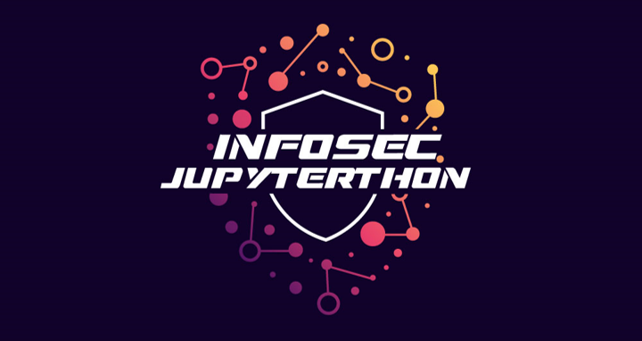
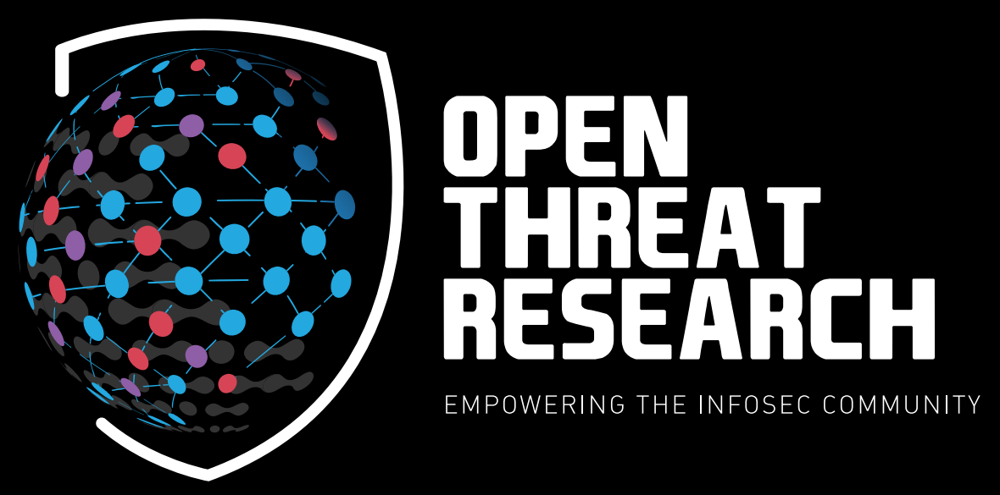
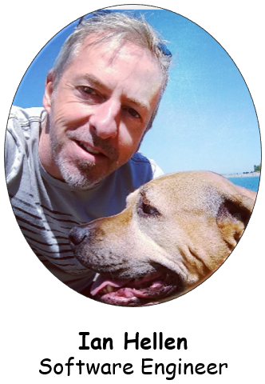
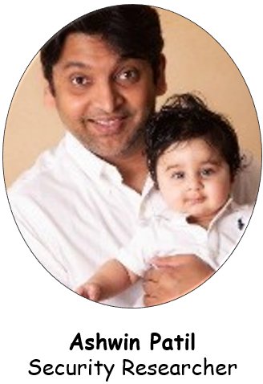

# Infosec Jupyterthon! (February, 2024)

  <a href="https://infosecjupyterthon.com/2022/agenda.html">Agenda</a> •
  <a href="#registration">Registration</a> •
  <a href="#call-for-notebooks">CFN</a> •
  <a href="#sponsors">Sponsors</a> •
  <a href="#community-collaborators">Collaborators</a> •
  <a href="https://infosecjupyterthon.com/conduct.html">Conduct</a> •
  <a href="#previous-editions">Previously</a>

---

An open community event for security researchers to share their experience and favorite [notebooks](https://jupyter.org/) with the InfoSec community. We meet virtually, share notebooks, and have fun learning more about Jupyter notebooks applied to the InfoSec field. A great place to meet other Infosec [Jovyans!](#what-is-a-jovyan-🪐)

## Web Site: https://infosecjupyterthon.com

## Quick Information 

* **When?** February 15th and 16th, 2024
* **Where?** Live Stream
    * https://aka.ms/JupyterthonLiveDay1
    * https://aka.ms/JupyterthonLiveDay2
* **How Much?** FREE
* **Discord Server**
    * Invite Link: https://aka.ms/JupyterthonDiscord
    * Channel: OTR Conferences > Jupyterthon

## Registration Form

https://aka.ms/JupyterthonRegistration

## Call For Notebooks
If you are using Jupyter notebooks for any use case applied to Infosec, we want to hear from you! Presentation slides are not required. You and a notebook is enough!.

* **CFN form:** https://aka.ms/JupyterthonCFN
* **CFN starts:** December 15th, 2023
* **CFN ends:** January 15th, 2024

### A few submission guidelines
* Well documented notebook with enough context (e.g. Markdown text) to tell the story behind your research.
* A well defined step by step process to go from basic to advanced skills.
* Use of open source code (e.g pandas) to allow attendees to replicate the research at home.
* Notebook and data should be freely releasable if possible.
* Talk types:
    * Lightning Talk - 5 minutes (i.e., Quick Idea, Favorite Notebook, Tips and Tricks)
    * Short Presentation - 15 minutes
    * Long Presentation - 30 minutes

## Sponsors

<table style="padding:10px">
  <tr>
    <td> 
        
    </td>
  </tr>
</table>

## Community Collaborators

<table style="padding:10px">
  <tr>
    <td> 
        
    </td>
    <td>
        
    </td>
    <td>
        
    </td>
    <td>
        
    </td>
  </tr>
  <tr>
    <td>
        
    </td>
    <td>
        
    </td>
    <td>
        
    </td>
    <td>
        
    </td>
  </tr>
</table>

## Previous Editions

### 2022 YouTube Recorded Streams

* Day 1: https://www.youtube.com/watch?v=8Mw1yyYkeqM
* Day 2: https://www.youtube.com/watch?v=h7BN5_BK0J8

### 2021 YouTube Recorded Streams

* Day 1: https://youtu.be/nMnHBnYfIaI?t=37
* Day 2: https://youtu.be/2Rb5B_RPDBc?t=19

## What is a Jovyan 🪐

You may see the word Jovyan used in Jupyter tools (such as the user ID in the Jupyter Docker stacks or referenced in conversations. But what is a Jovyan?

In astronomical terms, the word “Jovian” means “like Jupiter”. It describes several planets that share Jupyter-like properties.

Much like the planet Jupiter and our solar system, the Jupyter community is large, distributed, and nebulous. We like to use the word Jovyan to describe members of this community. Jovyans are fellow open enthusiasts that use, develop, promote, teach, learn, and otherwise enjoy tools in Jupyter’s orbit. They make up the Jupyter community. If you’re not sure whether you’re a Jovyan, you probably are :-)