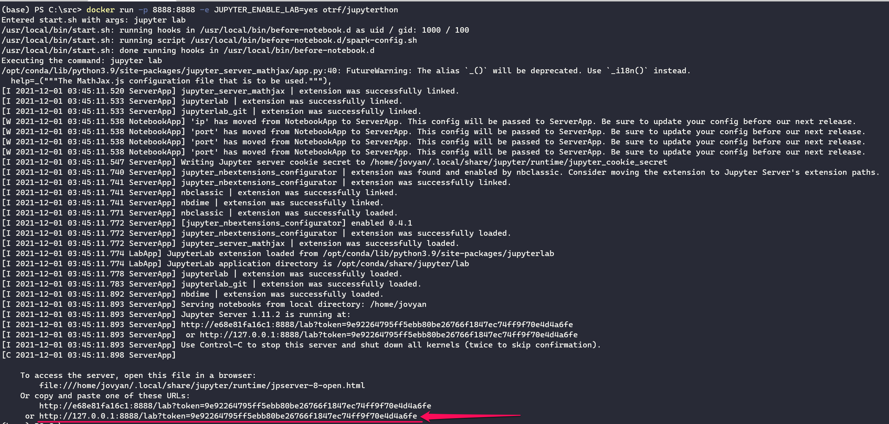

# Instructions for setting up the Workshop Notebooks

# Introduction

There are several ways that you can follow along with the sessions 
with your own copies of the notebooks that you can experiment with.
- Load our Docker image in Docker Desktop
- Clone the https://github.com/OTRF/infosec-jupyterthon repo and use a local Jupyter server
- Follow along with JupyterBook rendering of the notebooks on the InfoSecJupterthon site.
- Use nbviewer to get a high-fidelity rendering that retains some interactivity

We'll cover each of these - our recommendation is to use the Docker container with Docker Desktop

# Workshops in Docker Desktop

## What is Docker
Docker is an open platform for developing, shipping, and running application.Docker allow you to deploy development environment with consistent package dependencies across multiple workstations.
More Information about Docker : [Docker Docs](https://docs.docker.com/get-started/overview/)

## Install Docker Desktop
Docker Desktop is an easy-to-install application for your Mac or Windows environment that enables you to build and share containerized applications and microservices. Docker Desktop includes the Docker daemon (dockerd), the Docker client (docker), Docker Compose, Docker Content Trust, Kubernetes, and Credential Helper. 

1. Download and Install Docker 
    - [Docker for Windows](https://hub.docker.com/editions/community/docker-ce-desktop-windows) 
    - [Docker Desktop for Mac (macOS)](https://docs.docker.com/desktop/mac/install/)
2. Double click `Docker for Windows Installer` to run the installer
3. When the installation finishes, docker starts automatically. The whale icon in the notification area indicates that Docker is running, and accessible from a terminal.
4. Open a command-line terminal like PowerShell, and try out some Docker commands!
5. Run `docker version` to check the version.
6. Run `docker run hello-world` to verify that Docker can pull and run images.

## How to start/run Docker Image

 1. Pull OTRF\Jupyterthon:2021 image from Docker directly.

    ```bash
    docker run -p 8888:8888 -e JUPYTER_ENABLE_LAB=yes otrf/jupyterthon:2021
    ```

The following works with a relative path to an image into a subfolder next to the document:



2. Copy and paste the link into your web browser. Use the http://127.0.0.1 URL.
3. The JupyterLab UI should be displayed.
4. Navigate to the notebooks (in docs/workshops) and click on one to run

### Building your own Docker image
 1. You can also build DockerImage locally with the Dockerfile. Clone the OTRF/jupyterthon repo.
 
    ```bash
    git clone https://github.com/OTRF/infosec-jupyterthon.git
    ```
 2. Navigate to the repo directory.
 3. Run the command to build the image:
    ```bash
    docker build -t <name for image> .
    ```
  4. Run the image:
    ```bash
    docker run -p 8888:8888 -e JUPYTER_ENABLE_LAB=yes <name for image>
    ```
  5. Follow steps 2. and 3. from the previous section to run a notebook.

## How to attach Docker Image to VS Code
1. Install Docker extension for VS Code from extension tab.
2. Press `Ctrl+Shift+P` to go to command pallette and type **Remote-Containers: Attach to Running Container**
3. select container running on your host.
4. You will see in the bottom left the container attached.

    

For more information, check VS Code Docs [Developing inside a container](https://code.visualstudio.com/docs/remote/containers)

# Run the notebooks locally

## Install Python and Jupyter Lab
You'll need an installation of Python locally. If you don't have one you can install Python from:
- https://www.python.org/ - downloads
- The Windows Store (Windows only, obviously)
- Anaconda - https://www.anaconda.com/products/individual

If you use the Anaconda distribution, this already has Jupyter and Jupterlab installed. Otherwise install Jupyterlab using pip:

```bash
pip install jupyterlab
```

## Clone the infosec-jupyterthon GitHub repo

```bash
git clone https://github.com/OTRF/infosec-jupyterthon.git <path>
```
Substitute the folder where you want the repo to be downloaded for the <path> placeholder.

## Start JupyterLab

Assuming the the folder that you created in the previous step is "jupyterthon" (substitute whatever folder location you created).

```bash
cd ./jupyterthon
jupyter lab
```

The workshop notebooks are in the docs/workshop subfolder.


# Use the Infosec-Jupterthon JupyterBook

This is the simplest, but less interactive, option.
Open https://infosec-jupyterthon.com/workshops

1. Navigate to day1 or day2.
2. Click on the workshop page to open

The JupyterBook pages have the option to run in mybinder.org (launch the notebook with the rocket icon).

# Use nbviewer

1. Navigate to the jupyterthon GitHub repo as described in the previous step. Select a notebook to view and copy the link to that notebook.
2. Open https://nbviewer.org/
3. Paste the link from step 1 into the text box.
